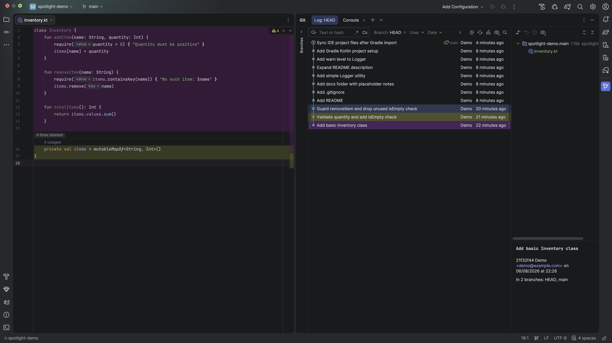
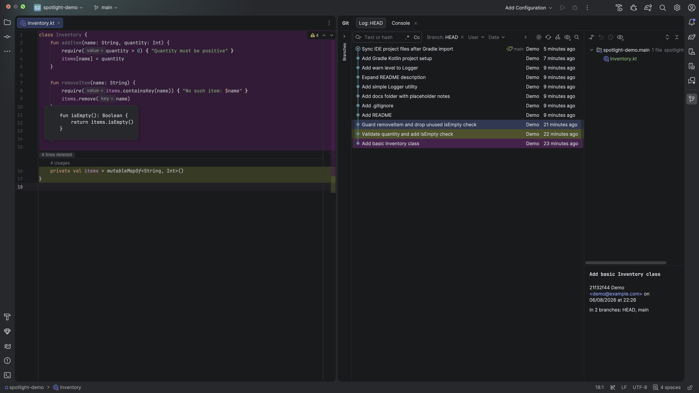
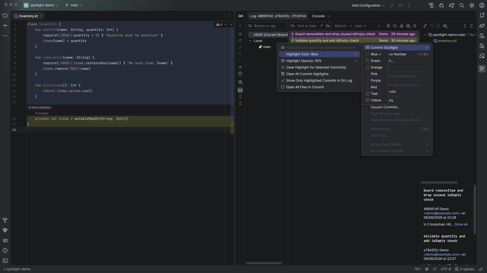
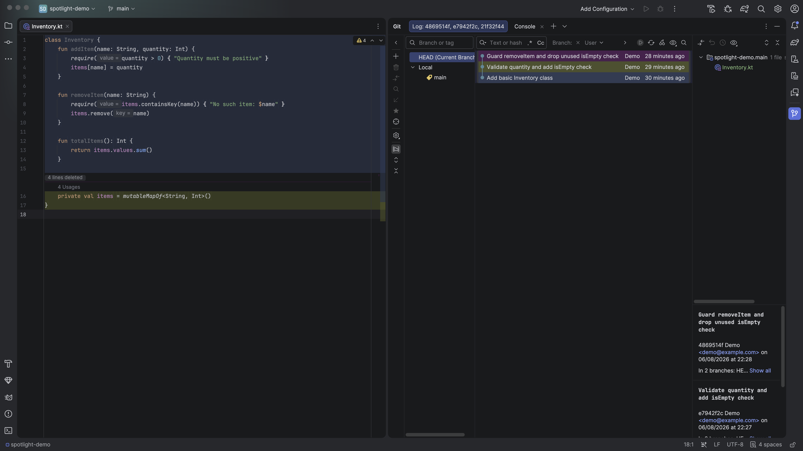

# Commit Spotlight

An IntelliJ Platform plugin that highlights, in your editor and the Git Log, exactly what a
commit touched — in colors you pick.

## Screenshots

<!-- Drop the actual PNGs into docs/screenshots/ with these filenames and these will render. -->


*A commit highlighted in a chosen color, visible both in the editor and across its row in the Git Log.*


*Hovering a "N lines deleted" label shows the actual removed code.*


*Picking a highlight color and adjusting opacity from the Git Log context menu.*


*"Show Only Highlighted Commits in Git Log" collapses the log down to just the commits you're tracking.*

## Features

- **Highlight changed/deleted lines** — select one or more commits in the Git Log and highlight
  the lines they added, changed, or deleted, directly in any open editor.
- **Deleted lines get a marker, not a guess** — since there's no surviving line to tint, deletions
  show as a colored divider with an inline "N lines deleted" label; hover it (or the right-hand
  gutter mark) to see the actual removed text.
- **Modified lines show what they used to say** — a "was N line(s)" pill appears at the end of
  the first line of each modified block; hover it (or the right-hand gutter mark on any line in
  the block) to see the text it replaced.
- **Rounded highlight blocks** — a contiguous run of changed lines renders as a single
  rounded-corner background block instead of a stack of sharp-edged rows.
- **8 colors, your choice** — picked per highlight run. Re-pick a color for an already-highlighted
  commit and it updates immediately, without re-running anything.
- **Adjustable opacity** — one global opacity setting applies to every color, so highlights blend
  with the editor background instead of reading as a flat, fully-opaque fill.
- **Choose which commit wins on overlapping lines** — when two highlighted commits touch the
  same line, "Prioritize Newest Commit on Overlapping Lines" decides whether the chronologically
  newest commit wins, or whichever was highlighted most recently (the default).
- **Full-row Git Log highlighting** — highlighted commits are tinted across their entire row in
  the log, not just in the editor.
- **Show only highlighted commits** — filter the Git Log down to just what you've highlighted.
- **Open all files in a commit** — jump straight to every file a commit touched.
- **Clear selectively or entirely** — clear just the currently-selected commit's highlight, or
  everything at once.

## Requirements

- An IntelliJ Platform IDE with Git support (Android Studio, IntelliJ IDEA, etc.) — see
  `sinceBuild` in `build.gradle.kts` for the minimum verified platform version.
- `git` available on your `PATH`.

## Known limitations

- **Merge commits aren't supported.** Their combined diff format isn't parsed, so selecting one
  won't contribute any highlights (you'll get a notification if none of your selected commits
  produced anything).
- Compatibility has only been verified against the exact platform branch declared in
  `build.gradle.kts`. It may work on older branches too, but that hasn't been tested.

## Building from source

```
./gradlew build
```

JDK 21 is auto-provisioned by Gradle if you don't already have one — no manual setup required.

By default the build points at `/Applications/Android Studio.app/Contents`. If your install
lives elsewhere, override it without editing `build.gradle.kts`:

```
./gradlew build -PandroidStudioPath="/path/to/Android Studio.app/Contents"
```

or via the `ANDROID_STUDIO_PATH` environment variable.

## Trying it out

```
./gradlew runIde
```

launches a sandboxed instance of the IDE with the plugin installed, so you can test changes
without touching your real IDE install.

## Installing into your own IDE

```
./gradlew buildPlugin
```

produces a distributable zip under `build/distributions/`. Install it via
**Settings → Plugins → ⚙ → Install Plugin from Disk...**

## Running tests

```
./gradlew test
```

## License

See [LICENSE](LICENSE).
